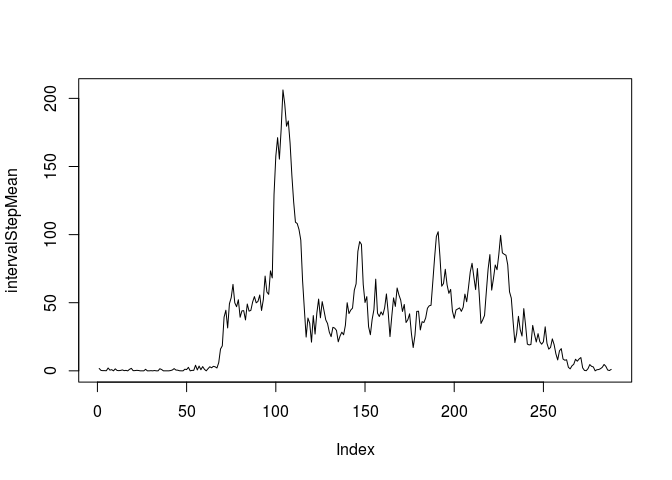

# Reproducible Research: Peer Assessment 1
collinturney  
February 18, 2017  

## Installing dependencies


```r
load_package <- function(package) {
    if (! package %in% installed.packages()) {
        install.packages(package)
    }
    library(package, character.only = TRUE)
}

load_package("plyr")
load_package("chron")
```

## Loading and preprocessing the data

First, extract the archived data if necessary.


```r
if (! file.exists("activity.csv")) {
    unzip("activity.zip")
}
```

Read in the dataset.


```r
data = read.csv("activity.csv")
```

Transform the date column to an actual date.


```r
data$date <- as.Date(data$date, format="%Y-%m-%d")
```

Lets look at a sample of the data.


```r
head(data)
```

```
##   steps       date interval
## 1    NA 2012-10-01        0
## 2    NA 2012-10-01        5
## 3    NA 2012-10-01       10
## 4    NA 2012-10-01       15
## 5    NA 2012-10-01       20
## 6    NA 2012-10-01       25
```

```r
sapply(data, class)
```

```
##     steps      date  interval 
## "integer"    "Date" "integer"
```

## What is mean total number of steps taken per day?

Calculate the total number of steps taken per day.


```r
stepsPerDay <- aggregate(steps ~ date, data, sum, na.rm=TRUE)
stepsPerDay
```

```
##          date steps
## 1  2012-10-02   126
## 2  2012-10-03 11352
## 3  2012-10-04 12116
## 4  2012-10-05 13294
## 5  2012-10-06 15420
## 6  2012-10-07 11015
## 7  2012-10-09 12811
## 8  2012-10-10  9900
## 9  2012-10-11 10304
## 10 2012-10-12 17382
## 11 2012-10-13 12426
## 12 2012-10-14 15098
## 13 2012-10-15 10139
## 14 2012-10-16 15084
## 15 2012-10-17 13452
## 16 2012-10-18 10056
## 17 2012-10-19 11829
## 18 2012-10-20 10395
## 19 2012-10-21  8821
## 20 2012-10-22 13460
## 21 2012-10-23  8918
## 22 2012-10-24  8355
## 23 2012-10-25  2492
## 24 2012-10-26  6778
## 25 2012-10-27 10119
## 26 2012-10-28 11458
## 27 2012-10-29  5018
## 28 2012-10-30  9819
## 29 2012-10-31 15414
## 30 2012-11-02 10600
## 31 2012-11-03 10571
## 32 2012-11-05 10439
## 33 2012-11-06  8334
## 34 2012-11-07 12883
## 35 2012-11-08  3219
## 36 2012-11-11 12608
## 37 2012-11-12 10765
## 38 2012-11-13  7336
## 39 2012-11-15    41
## 40 2012-11-16  5441
## 41 2012-11-17 14339
## 42 2012-11-18 15110
## 43 2012-11-19  8841
## 44 2012-11-20  4472
## 45 2012-11-21 12787
## 46 2012-11-22 20427
## 47 2012-11-23 21194
## 48 2012-11-24 14478
## 49 2012-11-25 11834
## 50 2012-11-26 11162
## 51 2012-11-27 13646
## 52 2012-11-28 10183
## 53 2012-11-29  7047
```

Make a histogram of the total number of steps taken each day.


```r
hist(stepsPerDay$steps)
```

<!-- -->

Calculate and report the mean and median of the total number of steps taken per day


```r
mean(stepsPerDay$steps, na.rm=TRUE)
```

```
## [1] 10766.19
```

```r
median(stepsPerDay$steps, na.rm=TRUE)
```

```
## [1] 10765
```

## What is the average daily activity pattern?

Make a time series plot (i.e. type = "l") of the 5-minute interval (x-axis) and the average number of steps taken, averaged across all days (y-axis)


```r
intervalStepMean <- tapply(data$steps, data$interval, mean, na.rm=TRUE)
plot(intervalStepMean, type="l")
```

<!-- -->

Which 5-minute interval, on average across all the days in the dataset, contains the maximum number of steps?


```r
intervalStepMean[intervalStepMean == max(intervalStepMean)]
```

```
##      835 
## 206.1698
```

## Imputing missing values

Calculate and report the total number of missing values in the dataset (i.e. the total number of rows with NAs).


```r
sum(is.na(data$steps))
```

```
## [1] 2304
```

Devise a strategy for filling in all of the missing values in the dataset. The strategy does not need to be sophisticated. For example, you could use the mean/median for that day, or the mean for that 5-minute interval, etc.

Strategy: impute by replacing NAs with the mean for that interval across all days in the dataset.


```r
impute.mean <- function(x) replace(x, is.na(x), mean(x, na.rm = TRUE))
```

Create a new dataset that is equal to the original dataset but with the missing data filled in.


```r
imputed_data <- ddply(data, ~ interval, transform, steps = impute.mean(steps))
```

Make a histogram of the total number of steps taken each day and Calculate and report the mean and median total number of steps taken per day. Do these values differ from the estimates from the first part of the assignment? What is the impact of imputing missing data on the estimates of the total daily number of steps?

Observe a slightly shifted median for the original versus the imputed data. The mean remains unchanged. Overall, the impact is not a large one. The daily step totals are very close to the original values.


```r
imputed_stepsPerDay <- aggregate(steps ~ date, imputed_data, sum, na.rm=TRUE)
hist(stepsPerDay$steps)
```

<!-- -->

```r
hist(imputed_stepsPerDay$steps)
```

<!-- -->


```r
mean(stepsPerDay$steps, na.rm=TRUE)
```

```
## [1] 10766.19
```

```r
mean(imputed_stepsPerDay$steps, na.rm=TRUE)
```

```
## [1] 10766.19
```

```r
median(stepsPerDay$steps, na.rm=TRUE)
```

```
## [1] 10765
```

```r
median(imputed_stepsPerDay$steps, na.rm=TRUE)
```

```
## [1] 10766.19
```

## Are there differences in activity patterns between weekdays and weekends?

Create a new factor variable in the dataset with two levels – “weekday” and “weekend” indicating whether a given date is a weekday or weekend day.


```r
imputed_data$day_type <- factor(chron::is.weekend(imputed_data$date), 
                                levels=c(TRUE, FALSE),
                                labels=c('weekend', 'weekday'))
```

Make a panel plot containing a time series plot (i.e. type = "l") of the 5-minute interval (x-axis) and the average number of steps taken, averaged across all weekday days or weekend days (y-axis).

Observing the interval means for weekdays versus weekends, there is a clear difference in the activity pattern. Weekend activity is higher and appears to start later in the day when compared to week days.


```r
imputed_data_weekday <- subset(imputed_data, day_type == 'weekday')
imputed_data_weekend <- subset(imputed_data, day_type == 'weekend')

intervalStepMean_weekday <- tapply(imputed_data_weekday$steps, imputed_data_weekday$interval, mean, na.rm=TRUE)
intervalStepMean_weekend <- tapply(imputed_data_weekend$steps, imputed_data_weekend$interval, mean, na.rm=TRUE)

par(mfrow=c(2,1))
plot(intervalStepMean_weekday, type="l")
plot(intervalStepMean_weekend, type="l")
```

<!-- -->
